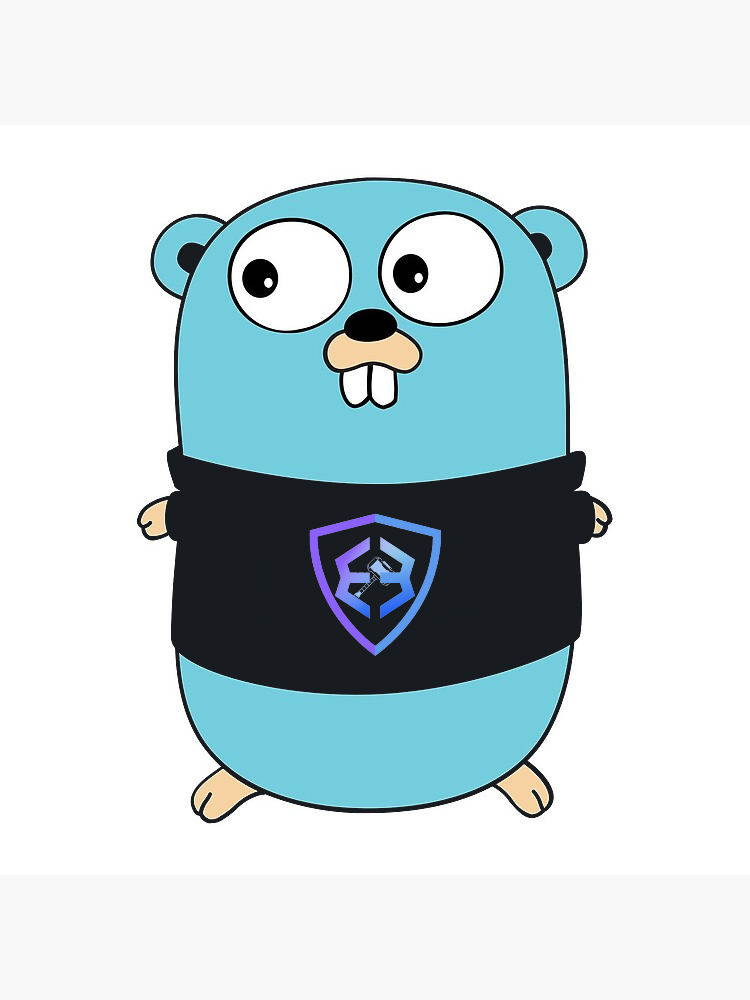

# Scraping & Scripts for the Scrappy Scooter

<p align="center">
    
</p>


Scripts to run as cron jobs or as one off executions.

### Current contents:
- General script to scrape first 100 bing search results for `exodus wallet` keywords and return anything that's not reddit or related to exodus [dot] com. Set to run on cron job if compiled (insert env vars before compilation) and running locally on cron job. Alerts via email. 
- Script prototype to run similar cron job on aws lambda
- Script to scrape Snap store for any malicious packages related to Exodus. Alerts via email. currently running locally on cron job. Insert env vars before compilation.
- Script to reconcile removed IoCs on our internal application ScamHitlist and cancel/close the corresponding alerts on ZeroFox platform where brand protection is housed. One time run needed.

#### Setup

Build for local scraping:
```go
go build -o general general.go
```

#### Build the Go script and zip for AWS Lambda. (WIP)

```zsh
<!-- > GOOS=linux GOARCH=amd64 go build -o main main.go -->
GOARCH=arm64 GOOS=linux go build -o bootstrap lambda.go
<!-- > zip main.zip main -->
zip boostrap.zip boostrap
```

For boostrap test, set upload as zip and enter test event to follow struct of `scrapeData` Test should succeed. 
Needs `.env` vars initialized in AWS. 
Set hanlder to `main`